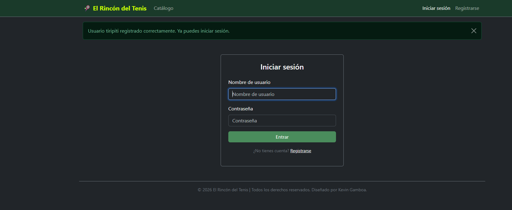
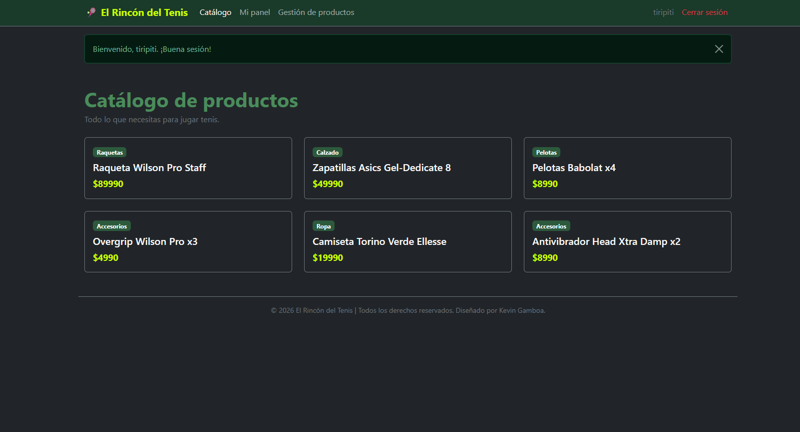
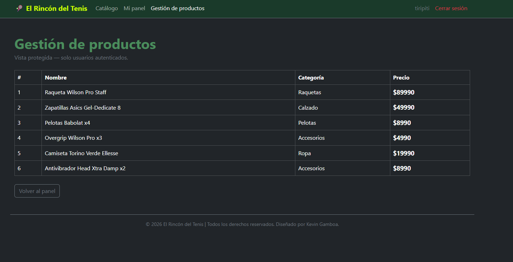

# 🎾 El Rincón del Tenis — Módulo 6

Aplicación web desarrollada con Python Django que implementa un sistema de autenticación de usuarios para el e-commerce El Rincón del Tenis.

---

## 🚀 Cómo ejecutar el proyecto

1. Clona el repositorio
2. Crea y activa el entorno virtual
```bash
python -m venv env
env\Scripts\activate
```
3. Instala las dependencias
```bash
pip install -r requirements.txt
```
4. Ejecuta las migraciones
```bash
python manage.py migrate
```
5. Crea un superusuario
```bash
python manage.py createsuperuser
```
6. Levanta el servidor
```bash
python manage.py runserver
```

---

## 🗺️ Rutas principales

| Ruta | Descripción | Protegida |
|------|-------------|-----------|
| `/` | Catálogo de productos | No |
| `/login/` | Inicio de sesión | No |
| `/register/` | Registro de usuario | No |
| `/logout/` | Cierre de sesión | Sí |
| `/panel/` | Panel del usuario | Sí |
| `/productos/` | Gestión de productos | Sí |
| `/admin/` | Sitio administrativo Django | Sí |

---

## 👤 Usuario de prueba

| Campo | Valor |
|-------|-------|
| Usuario | kevin |
| Contraseña | admin1234 |

---

## 📸 Evidencia



